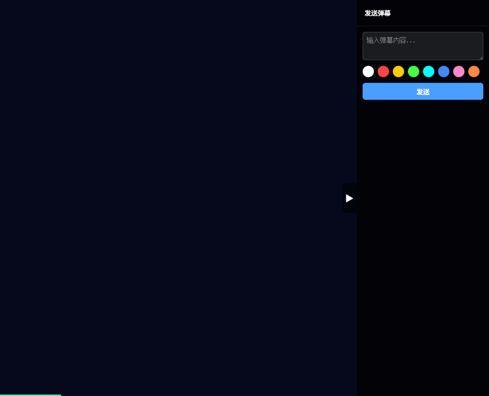
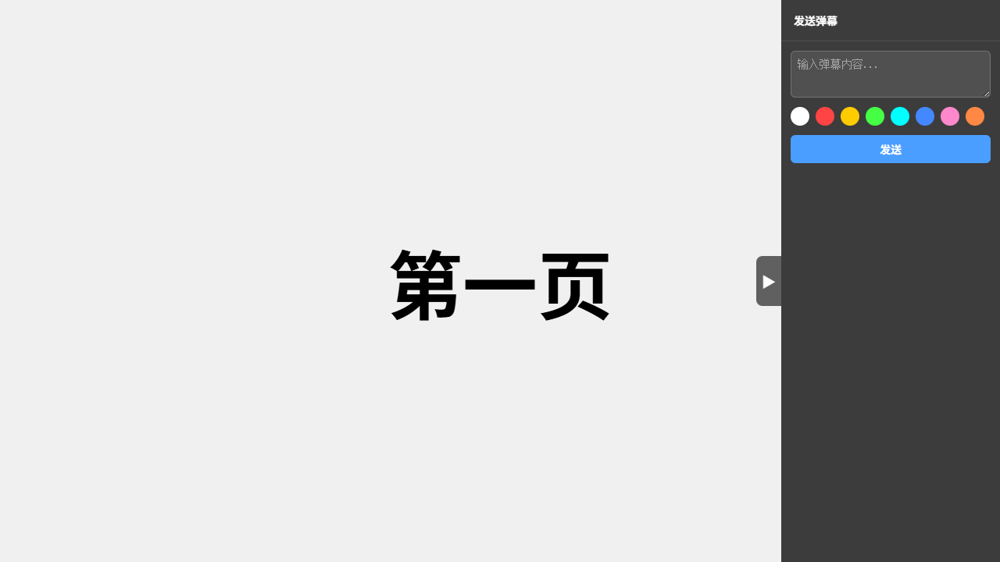
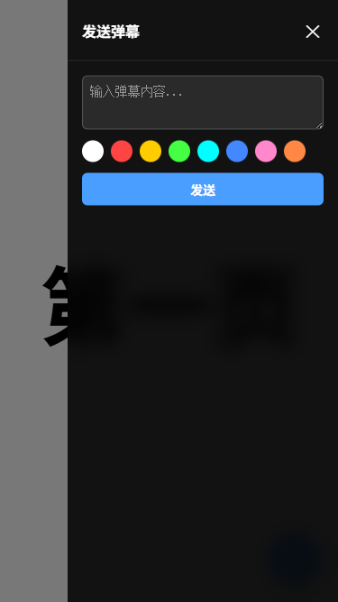
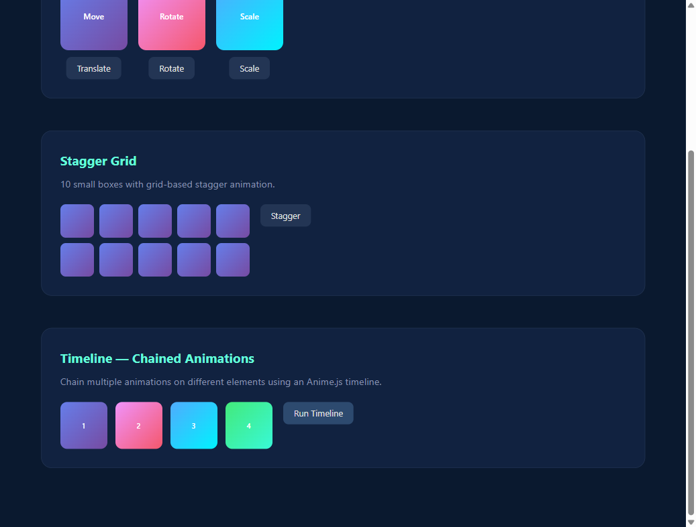

# Bullet Screen — 弹幕服务器

<p align="center">
  
  
  
</p>

<p align="center">给任意 HTML 演示文稿加上实时弹幕互动的本地服务器 —— 演讲者、管理者、观众三端协同</p>

<p align="center">
  <a href="README.md">中文</a> | <a href="README.en.md">English</a>
</p>

---

## 效果预览



| 桌面端观众面板 | 移动端抽屉 |
|:---:|:---:|
|  |  |

弹幕从右侧飘入,观众在侧边栏输入文字、选颜色发送;演讲者翻页时所有终端同步切换,演讲者触发的动画也会自动同步到观众端。

## 它解决什么问题

你用 [html-ppt](https://github.com/lewislulu/html-ppt-skill) 或任何 HTML 幻灯片做演讲,想让观众用手机/电脑实时发弹幕互动 —— 又不想引入复杂的第三方平台。

Bullet Screen 启动一个本地服务器,把一整套弹幕系统(渲染层 + 输入面板 + 管理审核)注入到你的 HTML 文件里,**零构建、零打包**,纯原生 JS + CSS。

## 功能特性

**核心**

- **三角色** —— 演讲者、管理者、观众,各自独立界面与权限
- **实时弹幕** —— WebSocket 即时推送,DOM 驱动渲染
- **翻页同步** —— 演讲者翻页自动同步到所有观众和管理者
- **管理者审核** —— 多管理者协同,无管理者在线时自动放行

**进阶**

- **演讲者控制栏** —— 清空、暂停/恢复、调速、调密度
- **动画同步** —— 演讲者触发的 CSS / WAAPI / GSAP / Anime.js / Lottie 动画自动在观众端重放
- **滚动同步** —— 演讲者在滚动式站点(scroll-snap 分屏)上滚动或点链接跳页,观众端自动跟随到同一位置;演讲者身份与弹幕层跨页面保持不断
- **注意力标注 + 防误选** —— 演讲者端标注重点,演讲中误选文字不会中断操作
- **一键外网分享** —— `Ctrl+Alt+S` 弹出二维码与外网链接(Cloudflare Tunnel)
- **移动端适配** —— 手机自动切换为悬浮按钮 + 侧滑抽屉
- **整站支持** —— 单文件 HTML 或多文件静态站点均可;多页面站点的每个 `.html` 子页面都会自动注入弹幕层(自动代理同源资源)

## 快速开始

### 1. 安装

```bash
git clone https://github.com/yourusername/bullet-screen.git
cd bullet-screen
npm install
```

### 2. 启动

```bash
# 用项目自带的测试幻灯片
node server.js examples/html-ppt-test.html

# 或者用你自己的 html-ppt 文件 / 静态站点入口
node server.js ~/my-talk/index.html
```

启动后,控制台会打印三个地址:

```
🎯 弹幕服务器已启动

局域网访问：
  演讲者:  http://192.168.3.48:3000/speaker?token=abcd1234...
  管理者:  http://192.168.3.48:3000/moderator
  观众:    http://192.168.3.48:3000/
```

### 3. 上手

1. **演讲者** —— 复制带 `token` 的 `/speaker` 链接在演讲设备打开(首次访问会自动种 cookie 并跳转到干净的 `/speaker`)
2. **管理者**(可选)—— 打开 `/moderator` 审核弹幕
3. **观众** —— 打开根路径 `/` 发弹幕观看

> [!NOTE]
> 没有管理者在线时,弹幕自动通过;有管理者在线时进入审核队列。直接访问 `/speaker` 而不带 token(或 cookie 过期),会自动跳转到观众页。

> [!TIP]
> 外网分享依赖 Cloudflare Tunnel(`cloudflared`)。未安装时仅提供局域网访问,不生成外网链接。
>
> **安装 cloudflared:**
> ```bash
> # Windows
> winget install --id Cloudflare.cloudflared
> # macOS
> brew install cloudflare/cloudflare/cloudflared
> ```
> 其他系统见 [Cloudflare 官方文档](https://developers.cloudflare.com/cloudflare-one/connections/connect-apps/install-and-setup/installation/)。

## 三种角色

### 演讲者 Speaker

- 全屏展示幻灯片,`←` `→` `空格` 翻页
- 底部控制栏:清空弹幕、暂停/恢复、调速、调密度、防误选开关
- `Ctrl+Alt+S` 打开分享弹窗(外网链接 + 局域网链接 + 二维码)
- 翻页与动画自动同步到所有观众

### 观众 Audience

- 同屏展示幻灯片
- **桌面端**:右侧可折叠侧边栏 —— 弹幕输入 + 8 色颜色选择器
- **移动端**:右下角悬浮按钮,点击滑出抽屉面板
- 地址:`/`(根路径,无需后缀)

### 管理者 Moderator

- 同屏展示幻灯片
- 右侧侧边栏:待审核弹幕列表,逐条「通过」或「拦截」
- 支持多管理者同时在线,共享审核队列

## 动画同步

演讲者端触发的动画会自动同步到所有观众端,无需额外配置。



**支持的动画类型:**

| 类型 | 自动同步 | 说明 |
|------|:---:|------|
| CSS `@keyframes` | ✅ | `classList.add()` 触发 |
| CSS Transition | ✅ | `style` / `class` 变化 |
| Web Animations API | ✅ | `element.animate()` |
| GSAP | ✅ | `gsap.to()` / `from()` / `timeline()` |
| Anime.js | ✅ | `anime({...})` |
| Lottie | ✅ | `play()` / `pause()` / `stop()` |
| 声明式标注 | ✅ | `data-bs-sync-anim` 属性(见下) |
| `:hover` / `:focus` 伪类 | ⚠️ 需标注 | 无法自动拦截,用声明式标注 |

**声明式标注**(用于 `:hover` 等无法自动拦截的场景):

```html
<div data-bs-sync-anim="hover-glow" data-bs-sync-trigger="hover">...</div>
<div data-bs-sync-anim="scroll-reveal" data-bs-sync-trigger="visible">...</div>
<div data-bs-sync-anim="fade-in" data-bs-sync-trigger="auto">...</div>
```

**5 个内置测试页**(验证各类动画同步):

```bash
node server.js examples/anim-test-css.html        # CSS Animation + Transition
node server.js examples/anim-test-waapi.html      # Web Animations API
node server.js examples/anim-test-gsap.html       # GSAP
node server.js examples/anim-test-anime.html      # Anime.js
node server.js examples/anim-test-declarative.html
```

## 技术架构

```
┌──────────────────────────────────────────────────────┐
│                  用户的 HTML 幻灯片                     │
│   ┌────────────────────────────────────────────────┐  │
│   │        服务端注入的弹幕系统层(public/)            │  │
│   │  渲染层 · 控制栏 · 角色 Panel · 注意力 · 动画同步   │  │
│   └────────────────────────────────────────────────┘  │
└──────────────────────────────────────────────────────┘
                            │ WebSocket (Socket.IO)
        ┌───────────────────┼───────────────────┐
        ▼                   ▼                   ▼
   Danmaku Store        Slide Sync        Moderator Queue
   (存储 + 审核)        (翻页状态)         (审核队列)
```

## 项目结构

```
bullet-screen/
├── server.js                  # Express + Socket.IO 入口
├── lib/
│   ├── html-injector.js       # HTML 注入器
│   ├── danmaku-store.js       # 弹幕存储(内存队列 + 审核)
│   ├── slide-sync.js          # 幻灯片同步状态
│   └── speaker-auth.js        # 演讲者 token 鉴权
├── public/                    # 注入到目标页面的前端资源
│   ├── danmaku.css            # 弹幕层 + UI 样式
│   ├── danmaku-renderer.js    # 弹幕渲染引擎
│   ├── slide-sync.js          # 翻页同步客户端
│   ├── audience-panel.js      # 观众侧边栏
│   ├── moderator-panel.js     # 管理者侧边栏
│   ├── attention.css / .js    # 注意力标注 + 防误选
│   └── anim-sync/             # 动画同步(触发钩子/库适配/回放引擎)
├── tests/                     # Jest 单元测试
│   ├── anim-sync/             # 动画回放单元测试
│   └── *.test.js              # 存储/注入/同步/鉴权/注意力
├── examples/                  # 示例幻灯片与动画测试页
├── docs/superpowers/          # 设计文档与实现计划
└── package.json
```

## 配置

| 方式 | 用途 | 示例 |
|------|------|------|
| 命令行参数 | HTML 文件路径 | `node server.js ./talk.html` |
| 环境变量 | 端口号 | `PORT=8080 node server.js ./talk.html` |

## 开发

```bash
npm test                                  # 运行 Jest 测试套件
node server.js examples/html-ppt-test.html   # 开发模式启动
```

测试覆盖:HTML 注入、弹幕队列与审核、幻灯片同步、演讲者鉴权、注意力标注、动画回放引擎。

## 通信协议

服务端与客户端通过 Socket.IO 通信,主要事件:

| 方向 | 事件 | 发起/目标 | 说明 |
|------|------|-----------|------|
| `→` | `danmaku:send` | audience | 发送弹幕 |
| `→` | `danmaku:block` | moderator | 拦截弹幕 |
| `→` | `slide:go` | speaker | 翻页 |
| `→` | `nav:go` | speaker | 滚动式/多页面站点的位置同步(页面路径 + section 索引) |
| `→` | `control:*` | speaker | 控制指令 |
| `←` | `danmaku:approved` | all | 弹幕已通过 |
| `←` | `danmaku:blocked` | all | 弹幕被拦截 |
| `←` | `slide:go` | audience/moderator | 翻页同步 |
| `←` | `slide:sync` | 新连接 | 当前幻灯片位置 |
| `←` | `nav:go` | audience/moderator | 跟随演讲者滚动或跳页 |
| `←` | `nav:sync` | 新连接 | 当前页面与 section(追赶) |

完整协议见 [设计文档](docs/superpowers/specs/2026-05-24-bullet-screen-design.md)。

## 浏览器兼容性

- Chrome / Edge ≥ 90
- Firefox ≥ 88
- Safari ≥ 14

> [!NOTE]
> 依赖 BroadcastChannel API,Safari 14 以下自动降级为键盘事件方案。

## 相关项目

- [html-ppt-skill](https://github.com/lewislulu/html-ppt-skill) —— 零构建的 HTML 幻灯片生成工具,本项目深度集成其翻页事件与动画系统
